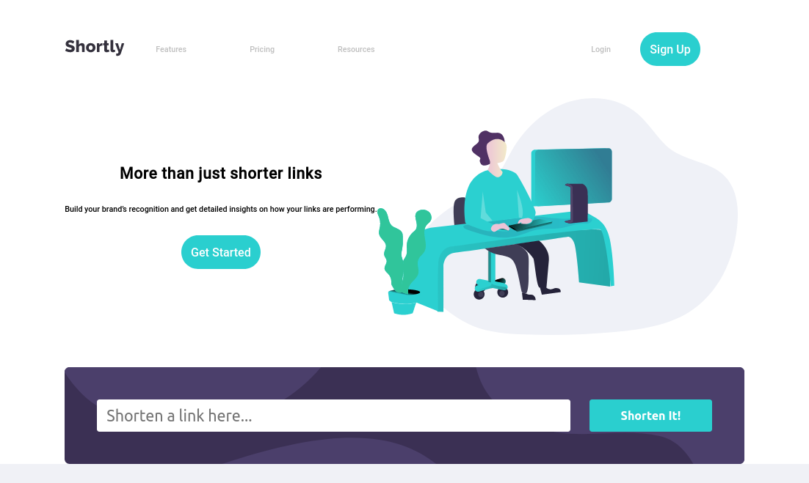
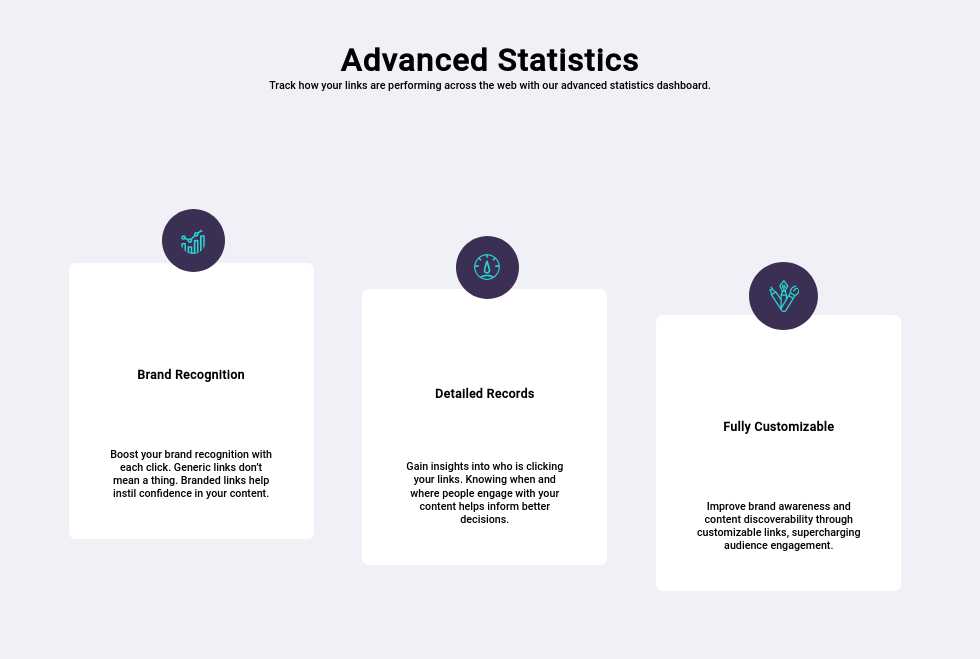
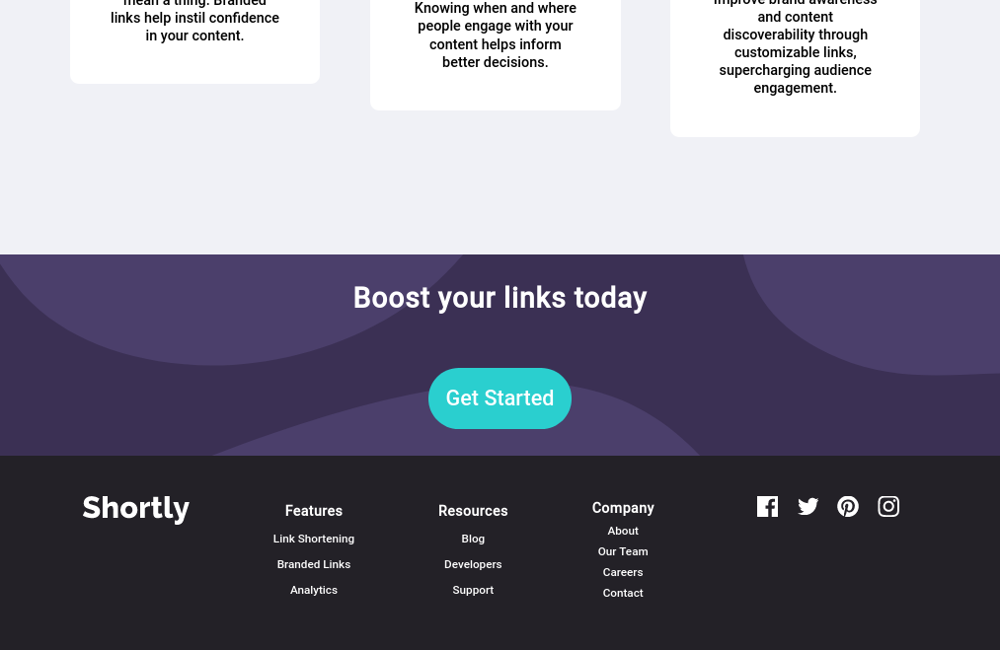
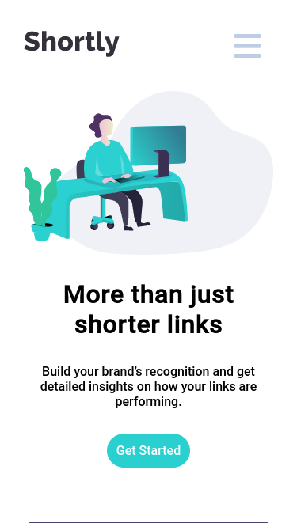
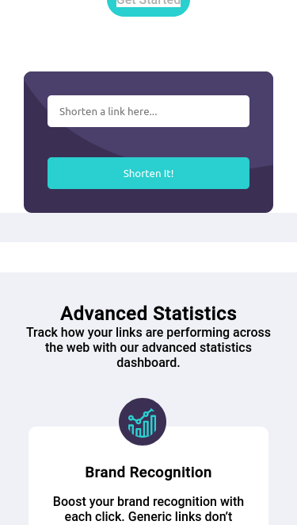
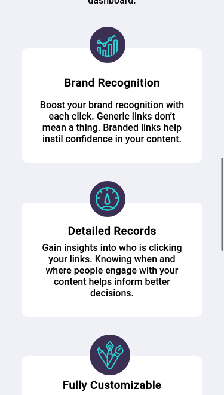
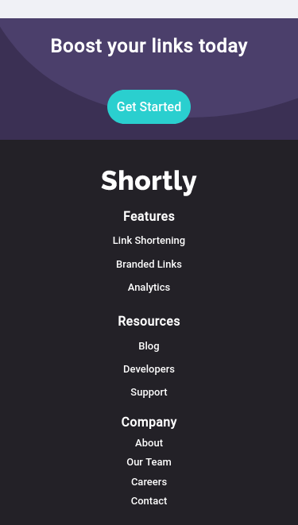

# Frontend Mentor - Shortly URL shortening API Challenge solution

This is a solution to the [Shortly URL shortening API Challenge challenge on Frontend Mentor](https://www.frontendmentor.io/challenges/url-shortening-api-landing-page-2ce3ob-G). Frontend Mentor challenges help you improve your coding skills by building realistic projects. 

## Table of contents

- [Overview](#overview)
  - [The challenge](#the-challenge)
  - [Screenshot](#screenshot)
  - [Links](#links)
  - [What I learned](#what-i-learned)
  - [Continued development](#continued-development)
- [Author](#author)


## Overview

### The challenge

Users should be able to:

- View the optimal layout for the site depending on their device's screen size
- Shorten any valid URL
- See a list of their shortened links, even after refreshing the browser
- Copy the shortened link to their clipboard in a single click
- Receive an error message when the `form` is submitted if:
  - The `input` field is empty

### Screenshot









### Links

- Live Site URL: (https://azizabacc.github.io/url-shortening-api/)


### What I learned


```css
#card2{
    position: absolute;
  
    transform: translate(30vw,4vh);
}
```
```js
////////eventlistner for copy buttons //////////////
const copyUrlEventListener = (copyButton) => {
    copyButton.addEventListener('click', () => {
      // delete class "copied" from other buttons
      const allButtons = document.querySelectorAll('.copyButton');
      allButtons.forEach(button => {
        if (button !== copyButton && button.classList.contains('copied')) {
          button.classList.remove('copied');
          button.innerText = 'Copy';
          button.style.backgroundColor ='hsl(180, 66%, 49%)'

        }
      });
  
      // Apply style and copy URL
      copyButton.classList.add('copied');
      copyButton.innerText = 'Copied!';
      copyButton.style.backgroundColor =' hsl(257, 27%, 26%)'

      const elementToCopy = copyButton.previousElementSibling;
      const textToCopy = elementToCopy.textContent;
  
      navigator.clipboard.writeText(textToCopy)
        .then(() => {
          console.log('Text copied to clipboard');
        })
        .catch(err => {
          console.error('Error in copying text: ', err);
        });
    });
  };
  

///// check url //////
  input.addEventListener("keypress", (event) => {
    if (event.key === "Enter") {
      if (input.value === "") {
        input.style.border = "3px solid hsl(0, 87%, 67%)";
      } else {
        const urlPattern = /^(https?:\/\/)?([^\s./]+\.[^\s]{2,}|www\.[^\s]+\.[^\s]{2,})$/i;
        if (urlPattern.test(input.value)) {
          console.log("Valid URL");
          input.style.border = "none"; 
          statisticDescContainer.style.marginTop = "0";
          shortUrl();
        } else {
          console.log("Invalid URL");
        }
      }
    }
  });
  
```


### Continued development

improve responsivity


## Author

- Frontend Mentor - [@azizabacc](https://www.frontendmentor.io/profile/azizabacc)


